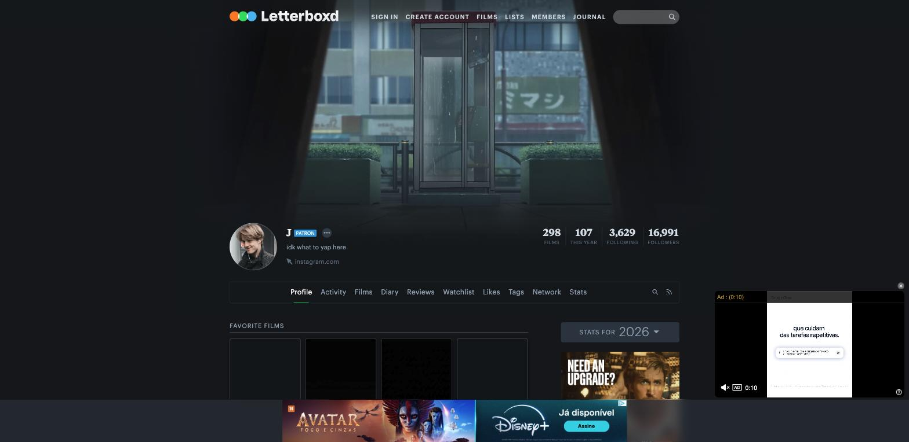
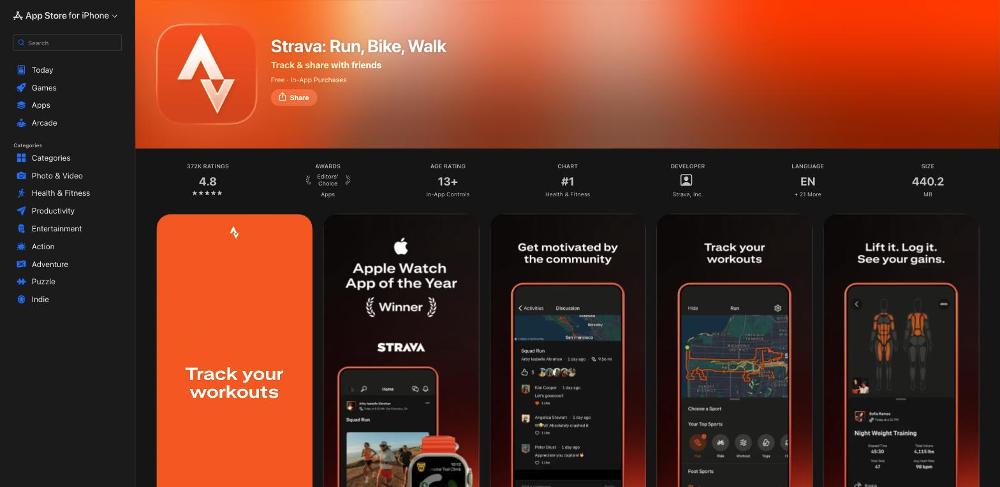
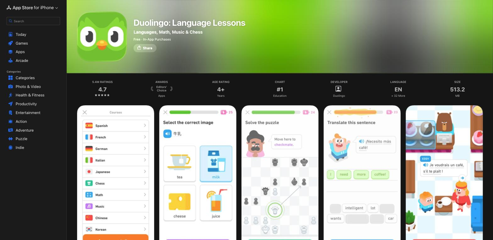

# References — Watchly

## 1. Objetivo

As referências abaixo orientam as decisões de experiência e interface do Watchly, que resolve o problema de **perfil pessoal, estatísticas de consumo e gamificação** para quem assiste filmes e séries — os três pilares do MVP.

## 2. Referência 01 — Letterboxd (Perfil)

### Fonte
Perfil público de usuário em letterboxd.com

### Imagem

### O que observamos?
O cabeçalho do perfil combina avatar, nome e uma faixa de métricas em destaque (filmes, filmes do ano, seguindo, seguidores) lado a lado, seguida de abas (Profile, Activity, Films, Diary, Stats...) que separam diferentes recortes dos mesmos dados.

### O que vamos aproveitar?
A ideia de um cabeçalho de perfil com avatar + resumo numérico rápido acima da dobra, e a separação clara entre "perfil" (identidade + resumo) e "estatísticas" (dados aprofundados) como destinos distintos de navegação.

### Como será adaptado?
No Watchly, a página `/perfil` reaproveita esse cabeçalho (avatar emoji + nome editável + resumo em `StatCard`s de filmes/séries/horas/conquistas), enquanto o detalhamento por gênero e tempo assistido fica na página dedicada `/estatisticas`, espelhando a separação Profile/Stats do Letterboxd.

## 3. Referência 02 — Strava (Estatísticas)

### Fonte
Capturas de tela do app na App Store (apps.apple.com/us/app/strava-run-bike-walk)

### Imagem

### O que observamos?
As telas de estatística do Strava usam cartões curtos com um valor numérico grande, um rótulo abaixo (ex: "Elapsed Time", "Total Volume", "Avg Heart Rate") e uma categorização visual por tipo de atividade ("Your Top Sports" com ícones por modalidade).

### O que vamos aproveitar?
O padrão de "cartão de estatística" (ícone + valor grande + rótulo) para métricas rápidas, e a ideia de categorizar o consumo por "tipo" (no Strava, esportes; no Watchly, gêneros de filme/série).

### Como será adaptado?
Criamos o componente `StatCard` (ícone via react-icons + valor + rótulo) usado em `/perfil` e `/estatisticas`, e uma versão simplificada de distribuição por categoria (`GenreBar`, barra horizontal de % por gênero) inspirada na lista "Your Top Sports", sem exigir uma biblioteca de gráficos.

## 4. Referência 03 — Duolingo (Gamificação)

### Fonte
Capturas de tela do app na App Store (apps.apple.com/us/app/duolingo-language-lessons)

### Imagem

### O que observamos?
No topo de cada tela de lição, o Duolingo mantém sempre visível um contador de XP/streak com ícone (raio) e uma barra de progresso da lição atual, reforçando constantemente o quão perto o usuário está de completar um objetivo.

### O que vamos aproveitar?
O par "ícone + contador + barra de progresso" como linguagem visual para conquistas, deixando claro o quanto falta para desbloquear cada uma, em vez de mostrar só um estado binário (bloqueado/desbloqueado).

### Como será adaptado?
O componente `AchievementBadge` do Watchly mostra ícone (bloqueado/desbloqueado), título, descrição e uma barra de progresso com "progresso/meta" (ex: 6/10 avaliações), na página `/conquistas`, seguindo a mesma lógica de progresso visível do Duolingo, adaptada para conquistas de consumo de filmes/séries em vez de streak de estudo.
